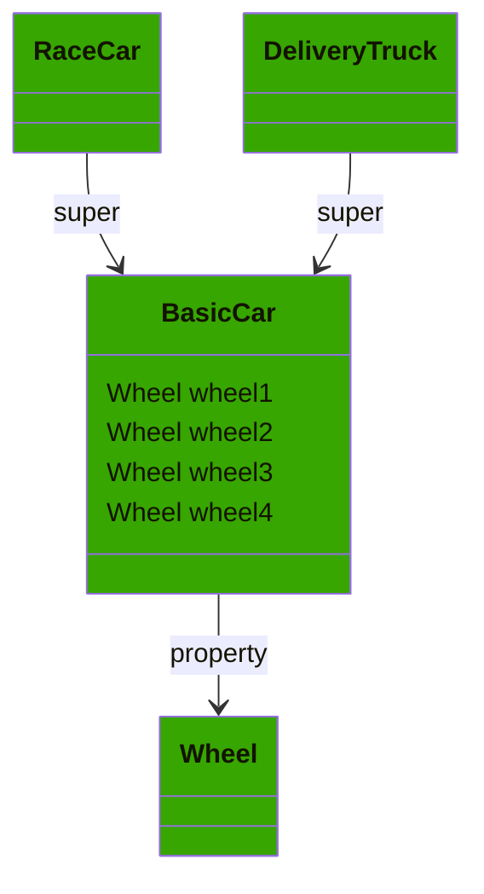
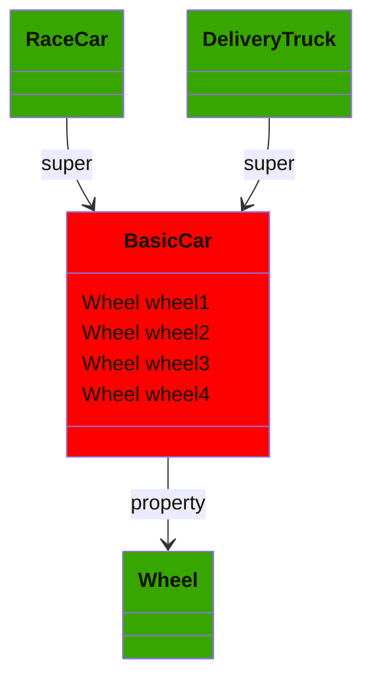
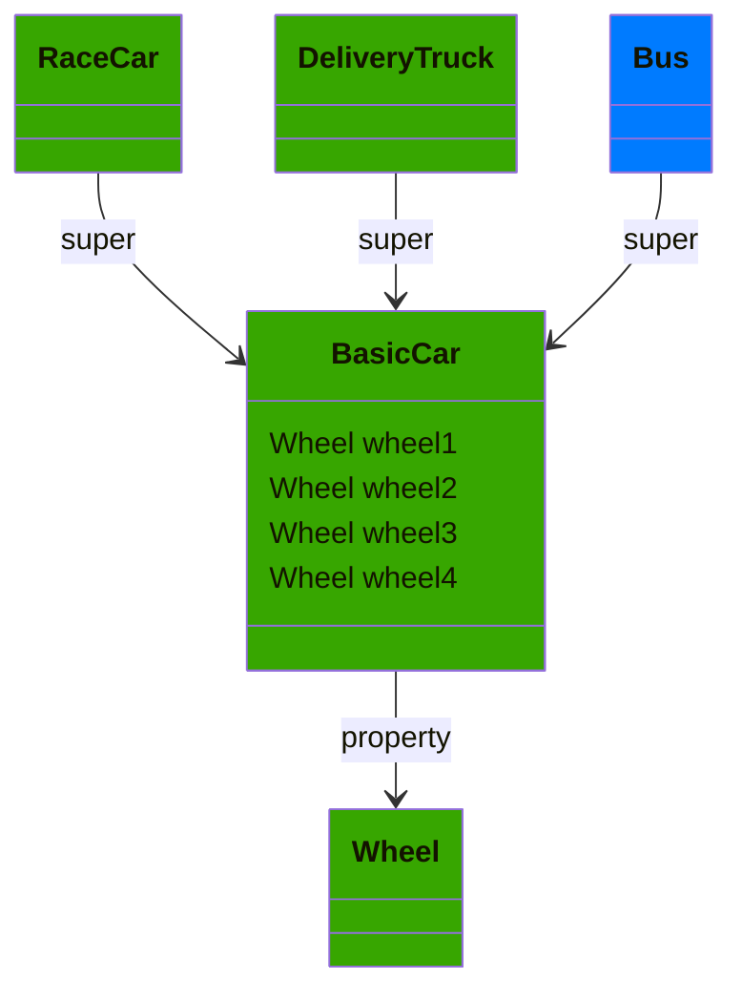
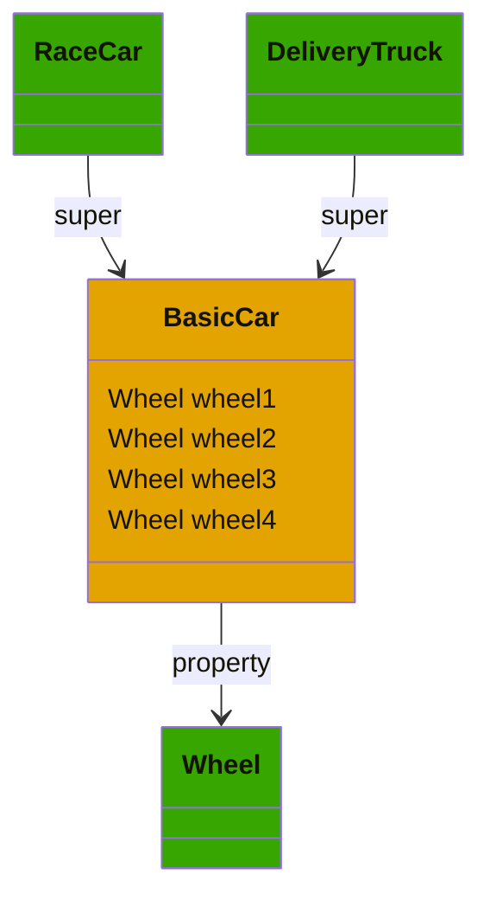

# ObjC Header Diff

The tool aimed to help finding differences between large Objective-C headers. Especially useful when order of entities
aren't the same between headers.

## Using

1. Add two Objective-C header files into `resources`: `actual.h` and `expected.h`
2. `./gradlew run`
3. In `out` directory there will be 4 files
    - `actual.h.md` report which contains `actual` header
    - `expected.h.md` report which contains `expected` header
    - `diff.md` report which contains merged dependencies tree of `actual` and `expected` headers
    - `diff.json` simplified report which contains basic diff information, useful to track multiple diffs

## What it might help to find

1. Expected interfaces or protocols, but not defined.
2. Defined interfaces or protocols, but not expected
3. Dependencies among interfaces/protocols (inheritance, generic, properties and method parameters)

## How it works

1. The tool parses two header files and builds dependencies graphs
2. Merges two graphs
3. Generates mermaid diagram based on merge, highlighting differences

## Examples

Examples below contain diffs of basic header with a `BasicCar`, `RaceCar` and `DeliveryTruck` 

```C++
@interface Wheel
@end

@interface BasicCar
@property (readonly) Wheel wheel1
@property (readonly) Wheel wheel2
@property (readonly) Wheel wheel3
@end

@interface RaceCar: BasicCar
@end

@interface DeliveryTruck: BasicCar
@end
```

### `Expected` and `actual` are equal: all classes are green



### Missing class `BasicCar`: marked with red



### Excessive class `Bus`: marked with blue



### `BasicCar` presented in `actual` and `expected`, but members (method or properties) are different, so the class marked with yellow



